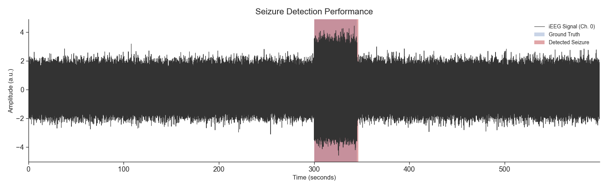

# Seizure Detection with Hyperdimensional Computing

This project provides a Python implementation of a seizure detection algorithm based on the principles of Hyperdimensional Computing (HDC), also known as Vector-Symbolic Architectures (VSA). The implementation is inspired by the methods described in the reference paper below, but with specific modifications to suit different objectives.

## Reference Paper

The core methodology is based on the following paper:

- **Hyperdimensional Computing With Local Binary Patterns: One-Shot Learning of Seizure Onset and Identification of Ictogenic Brain Regions Using Short-Time iEEG Recordings**
- DOI: [10.1109/TBME.2019.2919137](https://doi.org/10.1109/TBME.2019.2919137)

## Implementation Details & Deviations

This implementation was developed from scratch, as the data and source code linked in the reference paper were not accessible at the time of development.

A key difference in our approach lies in the objective. While the reference paper focuses on a balanced detection system, the primary goal of this project is to achieve **high sensitivity** and detect all potential seizure-like activity. The rationale is to create a tool for pre-processing and cleaning iEEG/EEG data, ensuring that no pathological events are missed. Consequently, the default thresholds for temporal consistency (`tc_threshold`) and confidence (`tr_threshold`) are set to be more inclusive than what might be proposed for a clinical alarm system.

A future goal is to accelerate the computation-heavy parts of this algorithm using PyTorch.

## Data & Preliminary Validation

Due to the difficulty in finding publicly available, continuously recorded iEEG data with precise seizure annotations, the initial validation was performed using two strategies:

1.  **Simulated Data**: A mock continuous signal was generated (`example_continuous.py`) to test the end-to-end pipeline, including event detection, margin application, event merging, and visualization.

2.  **Kaggle "Seizure Prediction" Dataset**: Data from the [UPenn and Mayo Clinic's Seizure Detection Challenge](https://www.kaggle.com/c/seizure-prediction) was used for a clip-based validation. Since this dataset provides `preictal` (before seizure) and `interictal` (between seizures) clips, `preictal` clips were used as a proxy for actual seizure events.
    -   **Test Case**: Using data from `Patient_1`, the classifier was trained on the first `interictal` and `preictal` clips.
    -   **Result**: The trained model correctly classified the subsequent test clips, serving as a successful proof-of-concept. Below are the results for 5 `Ictal` and 5 `Interictal` clips:
```
  - Ictal 1: Final Decision -> SEIZURE
  - Ictal 2: Final Decision -> SEIZURE
  - Ictal 3: Final Decision -> SEIZURE
  - Ictal 4: Final Decision -> SEIZURE
  - Ictal 5: Final Decision -> SEIZURE

  - Interictal 1: Final Decision -> NON-SEIZURE
  - Interictal 2: Final Decision -> NON-SEIZURE
  - Interictal 3: Final Decision -> NON-SEIZURE
  - Interictal 4: Final Decision -> NON-SEIZURE
  - Interictal 5: Final Decision -> NON-SEIZURE
```

Further validation on real-world, continuously annotated data is required to fully assess clinical performance.

## Project Structure

```
seizure_detection/
├── seizure_detector/        # The core Python package
│   ├── __init__.py          # Makes the directory a package
│   ├── data_handler.py      # Manages continuous signal data
│   ├── lbp_feature_extractor.py # Local Binary Pattern feature extraction
│   ├── hd_encoder.py        # Encodes features into hypervectors
│   ├── hdc_classifier.py    # The main classifier logic
│   ├── post_processor.py    # Post-processing (smoothing, margins, merging)
│   └── export.py            # Exports results to .fif format
│
├── example_continuous.py    # Example script for continuous signals
└── example_clips.py         # Example script for pre-segmented clips
```

## Installation

This project requires the following Python libraries. You can install them using pip:

```bash
pip install numpy matplotlib seaborn mne
```

## Usage

The project includes two example scripts to demonstrate its two main modes of operation.

### 1. Continuous Signal Mode

This mode is for analyzing a long, continuous recording to find the start and end times of seizure events.

```bash
python example_continuous.py
```
This will run a full pipeline on mock data, including training, classification, post-processing, visualization, and saving the results to `mock_ieeg.fif`.

An example of the output plot is shown below:



### 2. Clips Mode

This mode is for training and classifying on pre-segmented data clips.

```bash
python example_clips.py
```
This will train the classifier on several mock clips and then classify a new set of test clips, printing the final decision for each one. Example output:
```
Classifying test clips...
  - Test Clip 1 (Ictal): Final Decision -> SEIZURE
  - Test Clip 2 (Interictal): Final Decision -> NON-SEIZURE
  - Test Clip 3 (Ictal - borderline): Final Decision -> SEIZURE
  - Test Clip 4 (Interictal with noise): Final Decision -> NON-SEIZURE
``` 